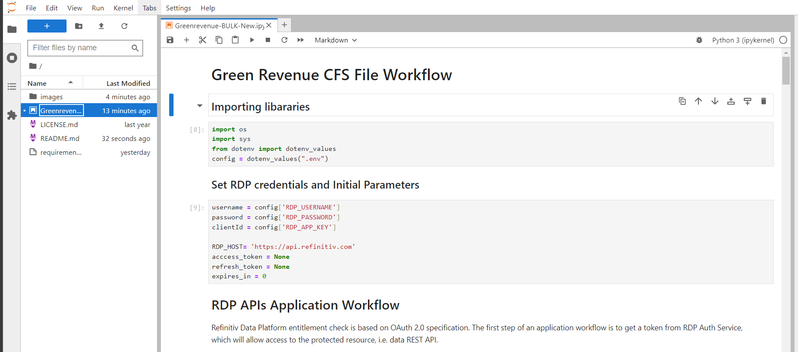

# RDP APIs Green Revenues CFS Bulk file Workflow
- version: 1.0
- Last update: July 2023
- Environment: Jupyter Notebook
- Prerequisite: [Access to RDP credentials](#prerequisite)

Example Code Disclaimer:
ALL EXAMPLE CODE IS PROVIDED ON AN “AS IS” AND “AS AVAILABLE” BASIS FOR ILLUSTRATIVE PURPOSES ONLY. REFINITIV MAKES NO REPRESENTATIONS OR WARRANTIES OF ANY KIND, EXPRESS OR IMPLIED, AS TO THE OPERATION OF THE EXAMPLE CODE, OR THE INFORMATION, CONTENT, OR MATERIALS USED IN CONNECTION WITH THE EXAMPLE CODE. YOU EXPRESSLY AGREE THAT YOUR USE OF THE EXAMPLE CODE IS AT YOUR SOLE RISK.

## <a id="intro"></a>Introduction

This demo application shows the workflow of the Refinitiv Data Platform (RDP) CFS Bulk API Feed for the FTSE Green Revenues data. I am demonstrating the workflow in [Python](https://www.python.org/) and [Jupyter](https://jupyter.org/) environment. However, the RDP APIs are the web-based API that any programming langues can connect and consume data from via the HTTP RESTful API. 

## <a id="prerequisite"></a>Prerequisite

Before I am going further, there is some prerequisite, dependencies, and libraries that the project is needed.

### Access to the RDP with the Green Revenues Bulk file permission

This project uses RDP access credentials with the Green Revenues Bulk file permission.

Please contact your Refinitiv representative to help you with the RTO account and services.

### Internet Access

This demonstration connects to RDP on AWS via a public internet.

### Python and Jupyter Notebook.

This project uses [Python](https://www.python.org/) and [Jupyter](https://jupyter.org/) environment.

The Python [Anaconda](https://www.anaconda.com/distribution/) or [MiniConda](https://docs.conda.io/en/latest/miniconda.html) distribution/package manager is recommended on.

## <a id="whatis_rdp"></a>What is Refinitiv Data Platform (RDP) APIs?

The [Refinitiv Data Platform (RDP) APIs](https://developers.refinitiv.com/en/api-catalog/refinitiv-data-platform/refinitiv-data-platform-apis) provide various Refinitiv data and content for developers via easy-to-use Web-based API.

RDP APIs give developers seamless and holistic access to all of the Refinitiv content such as Environmental Social and Governance (ESG), News, Research, etc, and commingled with their content, enriching, integrating, and distributing the data through a single interface, delivered wherever they need it.  The RDP APIs delivery mechanisms are the following:
* Request - Response: RESTful web service (HTTP GET, POST, PUT or DELETE) 
* Alert: delivery is a mechanism to receive asynchronous updates (alerts) to a subscription. 
* Bulks:  deliver substantial payloads, like the end-of-day pricing data for the whole venue. 
* Streaming: deliver real-time delivery of messages.

This example project is focusing on the Request-Response: RESTful web service delivery method only.  


For more detail regarding the Refinitiv Data Platform, please see the following APIs resources: 
- [Quick Start](https://developers.refinitiv.com/en/api-catalog/refinitiv-data-platform/refinitiv-data-platform-apis/quick-start) page.
- [Tutorials](https://developers.refinitiv.com/en/api-catalog/refinitiv-data-platform/refinitiv-data-platform-apis/tutorials) page.

## <a id="whatis_rdp"></a>About the Green Revenues Filesets.

Each week updates to the FTSE Green Revenues data are delivered to Refinitiv Data Platform (RDP) calculation engine. Refinitiv Bulk files are distributed in both Jsonl and Csv format. Refinitiv Data Platform (RDP) uses UTF-8, Unicode character  set. 

Refinitiv Bulk files are distributed in both Jsonl and Csv format. 

One fileset is created containing all organizations and history. 

Two types of data updates are available. 
* A full data fileset containing history for all organizations. 
* A delta data fileset that contains only incremental changes to the universe since last week. 

An incremental update is generated for each organization and period when there is a change to any value within that organization and period. 

The incremental update will contain all values for an organization and period, both the values that changed, and the values that  have remained the same. 

Filesets are published each Sunday by 11 pm UTC. 

The Green Revenue files are zipped and delivered as .gz files. The following naming convention is used for the .gz filesets.

For more detail regarding the Green Revenues Filesets, please see the following APIs resources: 
- [RDP Green Revenue user guide](https://developers.refinitiv.com/en/api-catalog/refinitiv-data-platform/refinitiv-data-platform-apis/documentation#green-revenues-user-guide)

Note: Files will remain accessible for 4 weeks before being removed. The zipped files can be uncompressed using standard tools such as 7-zip.


## <a id="how_to_run"></a>How to run the demo application

The first step is to unzip or download the example project folder into a directory of your choice, then set up Python or Docker environments based on your preference.

### <a id="python_example_run"></a>Run the demo application

1. Open Anaconda Prompt and go to the project's folder.
2. Run the following command in the Anaconda Prompt application to create a Conda environment named *CFS* for the project.
    ``` bash
    (base) $>conda create --name CFS python=3.9
    ```
3. Once the environment is created, activate a Conda *CFS* environment with this command in Anaconda Prompt.
    ``` bash
    (base) $>conda activate CFS
    ```
4. Run the following command to the dependencies in the *CFS* environment 
    ``` bash
    (CFS) $>pip install -r requirements.txt
    ```
5. Once the dependencies installation process is success, create a ```.env``` file with the following content
    ``` INI
    RDP_USERNAME=<Your RDP Username>
    RDP_PASSWORD=<Your RDP Password>
    RDP_APP_KEY=<Your RDP App key>
    ```
5. Then run the following command to start the Jupyter Lab application.
    ``` bash
    (CFS) $>jupyter lab
    ```
6. Open a ```Greenrevenue-BULK.ipynb``` file and run each cell to learn the workflow step by step.

    

## <a id="references"></a>References

That brings me to the end of my unit test example project. For further details, please check out the following resources:
* [Refinitiv Data Platform APIs page](https://developers.refinitiv.com/en/api-catalog/refinitiv-data-platform/refinitiv-data-platform-apis) on the [Refinitiv Developer Community](https://developers.refinitiv.com/) website.
* [Refinitiv Data Platform APIs Playground page](https://api.refinitiv.com).
* [Refinitiv Data Platform APIs: Introduction to the Request-Response API](https://developers.refinitiv.com/en/api-catalog/refinitiv-data-platform/refinitiv-data-platform-apis/tutorials#introduction-to-the-request-response-api).
* [Refinitiv Data Platform APIs: Authorization - All about tokens](https://developers.refinitiv.com/en/api-catalog/refinitiv-data-platform/refinitiv-data-platform-apis/tutorials#authorization-all-about-tokens).
* [Limitations and Guidelines for the RDP Authentication Service](https://developers.refinitiv.com/en/article-catalog/article/limitations-and-guidelines-for-the-rdp-authentication-service) article.
* [Getting Started with Refinitiv Data Platform](https://developers.refinitiv.com/en/article-catalog/article/getting-start-with-refinitiv-data-platform) article.
* [RDP CFS service (general) user guide](https://developers.refinitiv.com/en/api-catalog/refinitiv-data-platform/refinitiv-data-platform-apis/documentation#cfs-api-user-guide)
* [RDP Green Revenue user guide](https://developers.refinitiv.com/en/api-catalog/refinitiv-data-platform/refinitiv-data-platform-apis/documentation#green-revenues-user-guide)

For any questions related to Refinitiv Data Platform APIs, please use the [RDP APIs Forum](https://community.developers.refinitiv.com/spaces/231/index.html) on the [Developers Community Q&A page](https://community.developers.refinitiv.com/).